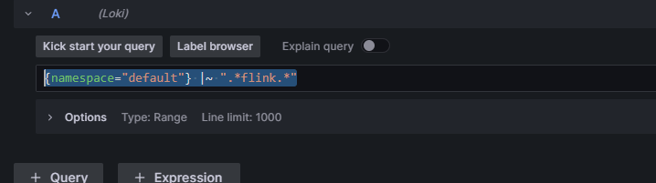

Запускаем $DockerFile$
```bash
docker compose -f .\dockerCompose\monitor.yml up -d   
```
Отлично, контейнеры запущены.

Для просмотра kafka смотрим в OffsetExplorer  
https://www.kafkatool.com/

Тут для докера открыть flink (перенести сначала jar в папку для jars[Flink-Streaming-with-kafka-and-cassandra-1.0-SNAPSHOT.jar](dockerCompose%2Fjars%2FFlink-Streaming-with-kafka-and-cassandra-1.0-SNAPSHOT.jar))
```bash
./bin/flink run ./usrlib/Flink-Streaming-with-kafka-and-cassandra-1.0-SNAPSHOT.jar  
```

Для просмотра кассандры - смотрим в vsCode (подключаемся admin/admin)
(SQLTools + SQLTools Cassandra Driver)

Метрики отдельные для job и task
```bash
cp ./plugins/metrics-prometheus/flink-metrics-prometheus-1.17.1.jar ./lib
```

Добавил конфиг в taskmanager + скопировать плагин туда (плагин для работы с prometheus)

psql -U docker -d exampledb -W

CREATE TABLE student(id integer primary key, name varchar);

CREATE TABLE student(id integer primary key, name varchar);

CREATE TABLE cars (
id SERIAL PRIMARY KEY,
name TEXT,
Horsepower INT,
cylinders INT
);

CREATE TABLE cars (
name TEXT PRIMARY KEY,
Horsepower INT,
cylinders INT
);

ALTER TABLE public.cars REPLICA IDENTITY FULL;

ALTER TABLE public.student REPLICA IDENTITY FULL;
insert into cars (name, Horsepower) values ('dima' , 2);

insert into cars (name, cylinders) values ('dima' , 66);

update cars set cylinders = 233 where name='rob';

insert into student (id, name) values (2, 'dd');

update student set name = 'dima' where id=5;

post localhost:8083/connectors

Content-Type | application/json

```json
{
  "name": "exampledb-connector",
  "config": {
    "connector.class": "io.debezium.connector.postgresql.PostgresConnector",
    "plugin.name": "pgoutput",
    "database.hostname": "postgres",
    "database.port": "5432",
    "database.user": "docker",
    "database.password": "docker",
    "database.dbname": "exampledb",
    "database.server.name": "postgres",
    "table.include.list": "public.student"
  }
}
```


```asciidoc
{
  "name": "exampledb2-connector",
  "config": {
    "connector.class": "io.debezium.connector.postgresql.PostgresConnector",
    "plugin.name": "pgoutput",
    "database.hostname": "postgres",
    "database.port": "5432",
    "database.user": "docker",
    "database.password": "docker",
    "database.dbname": "exampledb",
    "database.server.name": "postgres",
    "table.include.list": "public.cars"
  }
}
```


https://github.com/morsapaes/flink-sql-CDC

grafana

{namespace="default"} |~ ".*flink.*"


promtail собирает логи для LOKI

Номер дашборда для графаны
11049

{job="varlogs"} != `prometheus` != `loki` |~ `$search` | json | attrs_tag =~ ".*$name.*"
